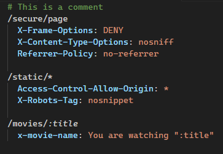
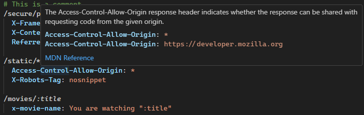

# _headers for Netlify and Cloudflare Pages

Syntax highlighting for the `_headers` file in [Netlify](https://docs.netlify.com/routing/headers/#syntax-for-the-headers-file) and [Cloudflare Pages](https://developers.cloudflare.com/pages/configuration/headers/).

## Features

### Syntax highlighting for `_headers` file

No more boring white text as you set content headers! Path segments are also highlighted.

### IntelliSense for HTTP headers

MDN data for various HTTP headers is displayed on hover.

## Known Issues

- Placeholders inside a hostname in Cloudflare Pages don't have correct syntax highlighting
